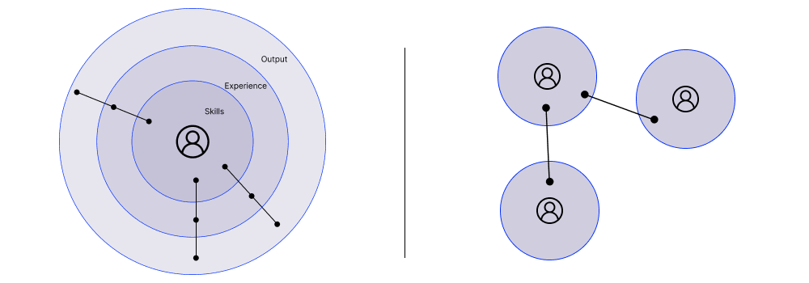
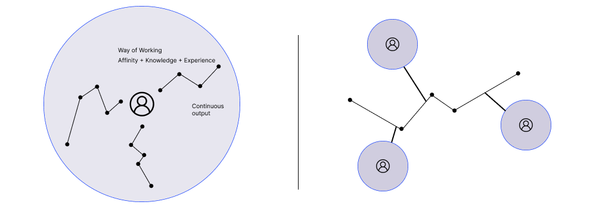
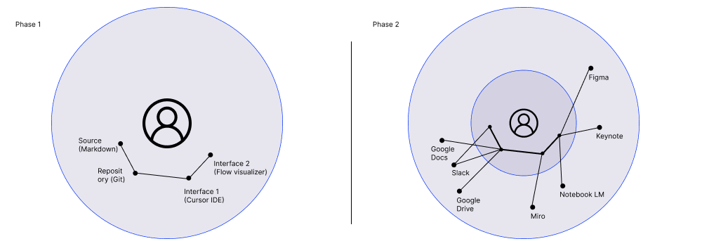

# Work-flow - data shaping organization

 _A Strategic Framework for Centralized Knowledge, Distributed Workflows, and Automated Context in the Age of AI._

## Abstract
In order to onboard us on AI native organization, we need to have space for cross-functional AI initiatives and sharing our learnings with others, but at the same time, I think we need also need to find strategical approach for adapting our workflows and changing habits of how we work with data and how to shape them.

How we colectively create, generate output and sharing of work items and knowledge. 
From People with skills and tools, to People shaping data flows/streams.

Here I illustrate some thoughts about an approach, utilizing a **Docs-as-Code** methodology to transform fractured knowledge islands into a coherent, queryable, and actionable system. We introduce a three-tier taxonomy of flows (Global, Domain, Local) and a standardized repository structure designed to maximize context retrieval for both human and AI agents.

If there would be a buy-in, I would love to ultimately setup a cross-functional, something like AI org ops, which would carry on that topic further.


## 1. Introduction: The Paradigm Shift

We are already witnessing this shift. Shift from "People with skills and tools" to "People shaping data flows". We have already begun an behavioral change, automatically transforming synchronous communication into text archives (e.g., recording calls). It becomes natural already to do so. But then we often "drop the ball" immediately after, failing to convert these archives into datasets, knowledge graphs, or open formats.

To become an AI-native organization, we must find a strategical approach for adapting our workflows and changing habits of how we work with data. The goal is to eliminate "fractured knowledge islands" - where there is a data disconnect in closed tools like Miro or Keynote - and move toward a unified, centralized repository.

## 2. The Concept of Work-Flow: From Points to Streams

To transition into an AI-native organization, we must redefine our fundamental unit of productivity. Term **Work-Flow** here represents a strategic shift in _how_ work flows through the organization, rather than just _what_ tasks are completed.
We can observe work from two different angles: As **Point System** (discrete output) and the  **Work-flow System** (continuous data streams). While the former relies on individual craftsmanship, the latter focuses on strategical approaches for adapting workflows to enable systemic intelligence.

### 2.1 Work as a "Point System"

The first perspective views work as a series of isolated events where an individual leverages their personal toolkit to produce a static artifact and hand over.
This model operates on the following formula:
**Me + My Skills + Experience = Output**

In this model, work is episodic. An output is created within a unit of time and then manually handed off to the next person. This creates "fractured knowledge islands", where information is trapped in specific tools (Miro, Figma, Google Drive) and requires manual friction to move forward. Once the output is handed over, the creator "drops the ball," leaving the data to stagnate rather than converting it into a reusable asset.

### 2.2 Work as Flow: The Continuous System

The **Work-Flow** approach replaces the Point System with a **Continuous System**. The focus shifts from the isolated completion of a task to the design of the _way of working_ itself. The new formula becomes:
**Me + Way of Working (Experience + Knowledge + Affinity) = Continuous Generation**

Here, the individual does not just produce an artifact as unit of work; they shape a data stream. The "Way of Working" is a composite of professional experience, domain knowledge, and personal affinity, but it is structured in a way that generates output continuously rather than in isolated bursts. We can imagine the flow being: briefing > benchmarking > synthesis > wireframing > testing > validation. 

Advantages:
1. **Transferability & Collaboration:** By defining the "Way of Working" explicitly, processes become transparent. We move away from relying on an individual's presence to relying on their structured flow, enabling new kinds of collaboration, similar to development push - pull.

2. **Adaptability & Tool Agnosticism:** A true Work-Flow is "tool agnostic" (to major extend). It is not dependent on a specific version of software and individual proficiency within that software. Because it relies on documentation and open standards, it can evolve and improve over time regardless of technological shifts (with appropriate experience, knowledge and affinity within the domain)

3. **Visualization:** Unlike the invisible mental processes of the Point System, a Work-Flow is externalized, visualized, mapped, and optimized, allowing us to see exactly where value is created or blocked.

4. **AI Compatibility:** Most importantly, the Continuous System is inherently compatible with LLMs and Autonomous Agents. When work is structured as a stream of data rather than a "fractured island", AI agents can easily integrate, assist, and automate segments of the process.

## 3. Methodology: Standardized Open Formats and Docs-as-Code

We deal with Fractured knowledge islands. We generate pieces of information in different tools (miro, figma, git, google drive, sheets, docs, notes, confluence, ChatGPT etc.) and then we are manually passing them on to others (copying information, calls, DMs, etc.)

To enable AI, we must not treat documentation as a static byproduct or work, usually after work is done and we must standardize our "raw material." It is a bit taken from Docs-as-Code methodology.  Documentation is the new source code—written in **Markdown**, stored in **Git repositories** (or different repository), versioned, and subject to pull requests.

### 3.1 Four Enablers:
1. **Tools agnostic** - We need to rely as little as possible on deep professional knowledge of specific tools, which always makes the work "exclusive" to privilege people.
2. **Open formats** - We need as little barriers as possible, as little compatibility issues between formats as possible, so we all need to embrace markdowns as our main document format
3. **Documentation** - extensive and continuous documentation (generated) for context building
4. **Centralized repository** - one source of truth with versioning, where we store data. Ogranisation itself can be handled by a workflow.md. Using git for that allows for granular version history and accountability

### 3.1  Flows - Global, Domain, Local
To organize the work, we propose splitting workflows into three distinct tiers, expanding on the hypothesis of global vs. specific flows.

#### Global Flows (The Organizational OS)

• **Definition:** Global Flows represent the universal truths and operational mechanics of the organization. These are the baseline processes and data points applicable to every individual in OH-SO, regardless of their role or project. They serve as the foundational "system prompt" for the agency's collective intelligence, especially when the work starts.

• **Content:** This layer includes the company’s mission, core values, and branding guidelines. It also houses the employee directory, organizational charts, and high-level operational policies (e.g., "How we work," generic communication standards). In a Markdown-based repository, this would be the root documentation that sets the tone for all generated work.
There also can be a "private" section, which would be outside of the main knowledge base.

• **Governance:** **Centralized & Strict.** Governance is maintained by the organization's leadership. Write access is restricted to a select group of maintainers to ensure consistency. The rest of the organization possesses "Read-Only" access, pulling this data to provide context for their specific tasks.

#### Domain Flows (The Discipline Layer)

• **Definition:** Domain Flows are discipline-specific workflows that define _how_ expert work is executed. They are agnostic to any specific client but specific to a profession (e.g., Research, UI Design, Development, PM). These flows replace static "skills" with documented, repeatable methodologies.

• **Content:** This layer contains the standardized procedures for execution.

    ◦ _Example (User Research Flow):_ Problem Definition > Stakeholder Interviews > Research Approach > Recruitment > Testing > Data Analysis > Presentation > Archiving.

    ◦ _Format:_ Each step is documented in standard Markdown templates, defining the inputs, outputs, and recommended tools.

• **Governance:** **Internal Open-Source.** Governance follows a "collaborative contribution" model. While Discipline Leads may own the master branch, every expert in that field is encouraged to contribute via Pull Requests (PRs). Flows are versioned (e.g., `research-flow-v2.md`), allowing the organization to iterate on its "Way of Working" continuously without breaking previous versions.

#### Local Flows (The Client Reality)

• **Definition:** Local Flows are ad-hoc, context-dependent workflows tailored to a specific client and their unique situation. Unlike Global or Domain flows, these are built "on the fly" during the project lifecycle. They represent the application of Global values and Domain expertise to a specific problem.

• **Content:** This includes the Project Brief, client-specific communication protocols (e.g., "How to document Jira tickets for Client X"), decision logs, and specific feedback loops. It also houses the raw data streams—transcripts of calls and emails—that are sanitized and stored as project context.

• **Governance:** **Decentralized & Ephemeral.** Governance belongs to the specific project team. These flows are created at the start of a project, modified as needs change. Everyone is able to read and write into them.


## 4. Repository Architecture & File Structure

A critical component of this system is a standardized directory structure. This structure ensures that both humans and AI agents know exactly where to write and retrieve information. We can let agents refactor the structure later on, based on the requirements in structure.md. 

**Repository structure sketch:**

```
/root
├── .meta/                     # Metadata for AI Context
│   ├── structure.md           # project structures
│   └── AGENTS.md              # Agent instructions
│
├── OH-SO/                     # organisation context (Global)
│   ├── README.md              # how to use and getting started
│   ├── CODE_OF_CONDUCT.md     # self explanatory
│   ├── AGENTS.md              # Agent instructions
│   ├── OH-SO_MANIFEST.md      # main manifest, values, org structure, etc.
│   └── COMMS/                 # communication context
│   │   ├── _raw/              # unprocessed data
│   │   ├── meetings.log       # processed meeting logs
│   │   └── decisions.log      # processed decisions
│   └── FLOWS/                 # global flows
│       ├── flow1.md           # description, purpose, context
│       └── ...
│
├── domains/                   # Professions Space
│   ├── README.md              # how to use and getting started
│   ├── creative/
│	│   └── FLOWS/             # Domain flows
│	│       ├── flow1.md     
│	│       └── ...
│   ├── technical/
│   ├── strategical/
│   ├── pm/
│   └── finance/
│
├── client_XY/                 # Project folder and local context
│   ├── README.md              # how to use and getting started
│   └── FLOWS/                 # Local/project flows
│	    ├── flow1.md    
│	    ├── progress.md        # flow for project tracking
│       └── ...     
│
└── archive/                   # Deprecated flows or past iterations
```

**Architectural Features:**

• **Basic areas:** A split between Global (OH-SO), Domain (Professions) and Local (Clients) areas and individual FLOWS folders are distributed in each, capturing various processes and functions. All agentic flows regarding the file monitoring, sanitization or structure checking should come from Global flows or agents.md files.

• **Affinity based Domains:** As the traditional split of disciplines is blurring, we could split the individual special domains based on type of thinking or affinity. Creativity or Aesthetics, Technical or Strategical thinking, over things like Design, Development, etc.

• **README:** Use of README files for both, humans and agents onboarding on the folder. There could be one flow for periodically checking the up-to-date state of the readme file.

• **The Sanitization Agent:** A specific AI agent monitors the `_raw/` folders. Its job is to process raw text, taking care about GDPR, content sensitive topics, etc.

• **Log files:** A critical file for long-term projects. It prevents circular discussions by documenting agreed-upon directions.

• **Progress Reporting:** With a proper structure, agent should be able to deliver structured reporting for organization health and steering. 

## 5. Rollout approach in two phases

To achieve this, we need a "cross-functional team" responsible for the strategy and democratization of these new processes. Testing, validation and changing the concept. 
It is important to onboard each and everyone into the new behavioral paradigm and base tools, otherwise there would be very little value out of the concept as information islands will be preserved and data missing. At first, this would mean doing the same things in a different way for many. Onboarding on basic concepts would be crucial undertaking. 


### Phase 1: Centralization (The Hard Skills)
Here, we would focus on the key basic set of tools, usage and functions. 

**Source:** 
How to create sources with Markdown and how markdown works. 

**Repositories**: 
How to push and pull your data, how to make a branch and how to merge it back. 

**Interfaces**: 
If the start, I would recommend minimal set of interfaces, which sits on top of the data. Ideally one for text and one for visual. With text, that could be IDE for creating and editing files, researching data, creating code. For visual, it is undefined so far, but I would stress the need of having a visual representation of data and dataflows.

### **Phase 2: Enablement (The Soft Overlay)**

In the second phase, we would expand and integrate a wider toolset, which people are accustomed to use and connect them in a way, so they are compatible with the workflow, via API, scripting or automation.
As a result, people should be able to work in interfaces they feel comfortable with, and which is matching their affinity, being Miro for strategical workshops, Notebook LM for research or Slack, Google Workspace, etc.

## 6. Conclusion

By treating our agency's knowledge as code, we prepare the organization for a future where AI is a collaborator, not just a tool. This architecture—grounded in a strict flow taxonomy and a transparent file structure—ensures that we stop "dropping the ball" on our data. Instead, we capture, sanitize, and structure it, creating a perpetual engine of context that makes every subsequent project smarter, faster, and more efficient.

